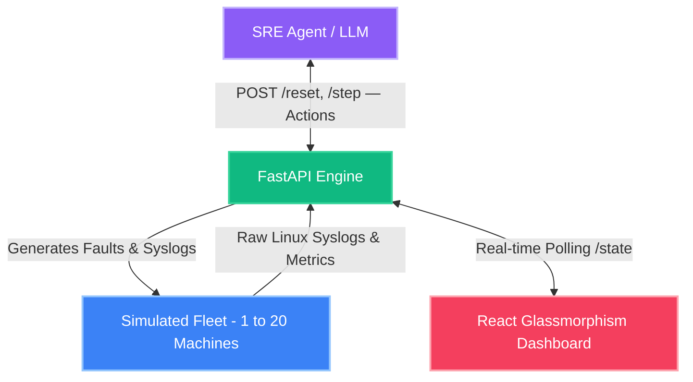

<p align="center">
  
</p>

# 🚀 SRE Fleet Gym: The Autonomous Incident Response Training Ground

> **SREs wake up at 3 AM to fix servers. Every minute of downtime costs $100,000. This environment trains autonomous agents to triage and resolve real Linux fleet outages — from full disks to cascading database deadlocks — so humans don't have to.**

**SRE Fleet Gym** is a high-fidelity reinforcement-learning environment built on the [OpenEnv](https://openenv.org) framework. It provides a rigorous, penalized sandbox where AI agents navigate production-grade outage scenarios — parsing raw Linux syslogs, executing surgical `kill -9` commands, and tracing dependency cascades across 20-machine fleets — in a battle against downtime.

## 🌟 Live Interactive Demo
[https://sandeep8327-src-simulator-hackathon.hf.space](https://sandeep8327-src-simulator-hackathon.hf.space)

*(The live dashboard is strictly read-only to prevent state mutation during agent evaluation. It will automatically poll and display the live state of the fleet once the agent initiates the `/reset` sequence.)*

---

## 🛠️ The Tech Stack
*   **Engine:** FastAPI, Python 3.10+ (OpenEnv Compliant)
*   **Simulation:** Pydantic-enforced state machines & deterministic anomaly generation
*   **Frontend:** React, TailwindCSS, Framer Motion (Cyberpunk Glassmorphism UI)
*   **Intelligence:** Groq LLM API (Llama 3 / Mixtral) with heuristic fallback
*   **Infrastructure:** Docker, Hugging Face Spaces

---

## 🏗️ How It Works (Architecture)



---

## 📋 The 3 Tasks & The Difficulty Curve

Our environment dynamically spawns fleets with Pydantic-enforced typing. Agents must survive three distinct difficulty tiers with a clear, logical progression:

| Task | Difficulty | Scenario | Machines | Key Challenge |
|------|-----------|----------|----------|---------------|
| `single_machine` | 🟢 Easy | **Full disk** — a `log_rotator` process is filling `/var/log` | 1 | Read syslogs, find the PID, kill it or clear disk |
| `multi_machine` | 🟡 Medium | **Mixed fleet faults** — CPU hogs, memory leaks, zombies, crypto miners | 5 | Prioritize triage across 5 machines with different faults |
| `cascade_failure` | 🔴 Hard | **Cascading DB deadlock** — a deadlocked PostgreSQL query causes cache timeouts → app 502s → edge failures | 20 | Trace root cause through 100+ log lines across 5 dependency tiers |

### 🔥 The "Cache Stampede" Trap
If an agent blindly restarts a broken cache layer before manually fixing the underlying database layer, it triggers a catastrophic **Cache Stampede**. The database CPU hits 100%, and the agent is struck with a massive `-0.20` scalar penalty. This tests real-world SRE sequencing — you must fix the root cause first.

---

## 👁️ Observation Space: What the Agent Sees

Unlike clean gym environments, SRE Fleet Gym requires agents to parse **both** structured metrics and **raw, noisy Linux syslog output** — just like a real SRE reading `journalctl` at 3 AM:

### Structured Telemetry
- **CPU/Memory/Disk metrics** per machine (floats)
- **Process table** with PID, name, state (`running`/`zombie`/`dead`), and `is_anomaly` flag
- **Dependency graph** mapping upstream/downstream machine relationships

### Raw Syslog Output (`syslog_tail`)
Multi-line, realistic `journalctl`/`dmesg` blocks with **noise mixed in**. The agent must filter signal from noise:

```
Apr 11 03:14:07 prod-db-01 CRON[4821]: (root) CMD (/usr/sbin/logrotate /etc/logrotate.conf)
Apr 11 03:14:07 prod-db-01 sshd[3947]: Accepted publickey for deploy from 10.0.1.42 port 22 ssh2
Apr 11 03:14:08 prod-db-01 postgresql[950]: LOG:  deadlock detected — Process 950 waits for ShareLock on transaction 847291; blocked by process 2847
Apr 11 03:14:08 prod-db-01 postgresql[950]: HINT:  See server log for query details.
Apr 11 03:14:09 prod-db-01 kernel: [42069.123] postgres: connection pool exhausted (max_connections=200, active=200, waiting=847)
Apr 11 03:14:09 prod-db-01 systemd[1]: postgresql.service: Watchdog timeout — connection backlog critical
Apr 11 03:14:10 prod-db-01 node_exporter[2891]: msg="Scrape complete" duration_seconds=0.003
```

---

## ⚡ Action Space: What the Agent Can Do

All actions map to **real Linux terminal commands**, not abstract buttons:

| Command | Linux Equivalent | Description |
|---------|-----------------|-------------|
| `kill_pid` | `kill -9 <PID>` | Surgically terminate a specific process by PID |
| `restart_service` | `systemctl restart <service>` | Restart a named service (⚠️ can trigger cache stampede) |
| `reboot` | `shutdown -r now` | Nuclear option — clears all faults but incurs `-0.10` downtime penalty |
| `check_logs` | `journalctl -u <svc> -n 50` | Diagnostic: enriches syslog output, triggers `log_read` milestone |
| `drain_node` | `kubectl cordon <node>` | Isolate machine from dependency graph, prevents cascade propagation |
| `clear_disk` | `find /var/log -name '*.gz' -delete` | Clear disk space, kill disk-filling processes |
| `noop` | *(wait)* | Observe and do nothing |

---

## ⚖️ Reward Shaping: Milestone-Based Partial Progress

We don't use a sparse binary `0/1` reward. Instead, SRE Fleet Gym uses a **milestone-based reward function** with **5+ distinct breakpoints** across every episode:

### Milestones (✅ Partial credit at every step)
| Milestone | Weight | Trigger |
|-----------|--------|---------|
| `log_read` | +0.10 | Agent inspected the machine's syslog (via `check_logs` or targeting the machine) |
| `pid_identified` | +0.25 | Agent issued `kill_pid` with the correct anomaly PID |
| `node_isolated` | +0.15 | Agent used `drain_node` to prevent cascade propagation |
| `service_restored` | +0.25 | Machine transitioned to HEALTHY status |

### Penalties (❌ Real consequences for bad decisions)
| Penalty | Weight | Trigger |
|---------|--------|---------|
| Wrong kill | -0.15 | Killing a non-anomaly process (e.g., `systemd`, `sshd`) |
| Brute-force reboot | -0.10 | Using `reboot` instead of surgical fix |
| Cache stampede trap | -0.20 | Restarting cache before fixing upstream database |
| SLO burn rate | -0.01 to -0.04/step | Broken infrastructure incurs tier-weighted penalties (DB > cache > app > edge) |
| Step penalty | -0.005/step | Encourages efficiency |

### Example Reward Curve (cascade_failure task)
```
Step  1: 0.13  ← killed deadlocked query on db-01
Step  2: 0.21  ← killed CPU hog on cache-02
Step  3: 0.27  ← killed zombie on app-02
Step  4: 0.35  ← killed fork bomb on app-05
Step  5: 0.44  ← killed crypto miner on app-06
Step  6: 0.52  ← killed runaway loop on app-08
Step  7: 0.59  ← cleared disk on edge-01
Step  8+: 0.55–0.51 (step penalty decays while fleet self-heals)
```

---

## 📊 Baseline Proof: Verified Scores

The following scores were achieved by our deterministic heuristic agent (`inference.py`) running against the local environment:

| Task | Score | Steps | Strategy |
|------|-------|-------|----------|
| `single_machine` | **0.96** | 2 | `check_logs` → `kill_pid 999` (log_rotator) |
| `multi_machine` | **0.95** | 5 | Sequential `kill_pid` on all 5 anomaly PIDs |
| `cascade_failure` | **0.79** | 7 active + 18 noop | Fix in tier order: db → cache → app → edge |
| **Total** | **2.70 / 3.0** | | |

> The environment is **solvable but challenging**. A perfect agent could achieve ~2.97/3.0 by combining `check_logs` for milestones, `drain_node` for cascade prevention, and optimal fixing order — leaving room for RL/LLM agents to improve.

---

## ⚡ Quick Start: Run It Locally

### 1. Using Docker (Recommended)
The fastest way to get the full environment (including the dashboard) running exactly as it does on Hugging Face:
```bash
docker build -t sre-fleet-gym .
docker run -p 7860:7860 sre-fleet-gym
```
Access the dashboard at: `http://localhost:7860`

### 2. Manual Installation
If you prefer running without Docker:
```bash
# Install dependencies
pip install -r requirements.txt

# Start the simulator & dashboard
uvicorn app:app --port 7860 --reload

# In a new terminal, run the agent (Heuristic/Deterministic)
python inference.py

# OR: Run with LLM Intelligence (Requires API Key)
export HF_TOKEN="your_key"
export API_BASE_URL="https://api.groq.com/openai/v1"
export MODEL_NAME="llama3-70b-8192"
python inference.py
```

### 3. API Quick Test
```bash
# Reset environment to easy task
curl -X POST http://localhost:7860/reset -H "Content-Type: application/json" -d '{"task_name": "single_machine"}'

# Check logs on the machine (triggers log_read milestone)
curl -X POST http://localhost:7860/step -H "Content-Type: application/json" -d '{"machine_id": "m-001", "command": "check_logs"}'

# Kill the offending process
curl -X POST http://localhost:7860/step -H "Content-Type: application/json" -d '{"machine_id": "m-001", "command": "kill_pid", "target": "999"}'

# Grade the episode
curl -X POST http://localhost:7860/grader
```

---

## 📁 Project Structure
```
├── app.py                 # FastAPI server (OpenEnv endpoints)
├── fleet_simulator.py     # Core: fleet spawning, action execution, reward calculation
├── graders.py             # Milestone-based episode grading (easy/medium/hard)
├── inference.py           # Baseline agent (heuristic + LLM fallback)
├── openenv.yaml           # OpenEnv manifest (tasks, spaces, reward docs)
├── Dockerfile             # Production container
├── requirements.txt       # Python dependencies
└── Design Cyberpunk Dashboard/  # React frontend (built static assets)
```
