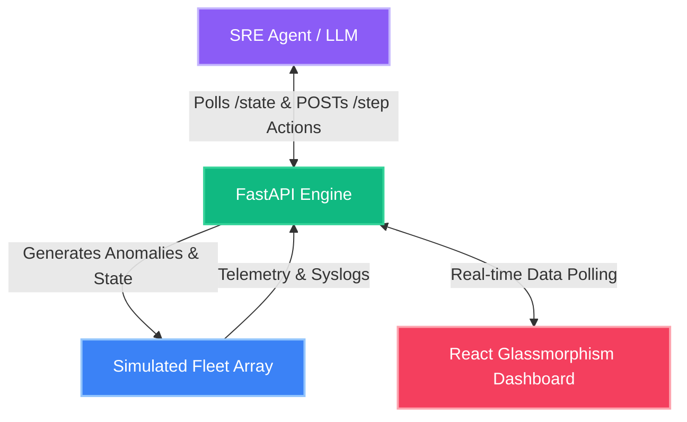

<p align="center">
  
</p>

# 🚀 SRE Fleet Gym: A flight simulator for autonomous incident response agents

> An OpenEnv-compliant reinforcement-learning environment dedicated to solving the enterprise infrastructure crisis.

## 🌟 Live Interactive Demo
[https://sandeep8327-src-simulator-hackathon.hf.space](https://sandeep8327-src-simulator-hackathon.hf.space)

*(The live dashboard is strictly read-only to prevent state mutation during agent evaluation. It will automatically poll and display the live state of the fleet once the agent initiates the /reset sequence.)*

---

## 🛠️ Tech Stack
This project leverages a modern, high-performance stack:
* **Frontend**: React, TailwindCSS, Framer Motion, Recharts, Radix UI / Shadcn
* **Backend Engine**: FastAPI, Uvicorn, Python 3.10+
* **AI Integration**: Groq LLM API (Llama 3 / Mixtral for high-speed deterministic JSON parsing)
* **Deployment**: Docker, Hugging Face Spaces (OpenEnv compliant)
* **Styling**: Cyberpunk-inspired Glassmorphism UI

---

## 🏗️ How It Works (Architecture)



* **Simulated Server**: Dynamic Pydantic-enforced node states (CPU, Memory, Syslogs)
* **FastAPI**: The core OpenEnv Gym simulator logic and API router
* **LLM**: The autonomous SRE Copilot reading structured & unstructured data
* **React Dashboard**: The beautiful mission control UI visualizing it all

---

## ⚡ The "Why": Real-World Utility
SRE downtime costs massive enterprises millions of dollars per minute. Restoring complex dependencies (database layer -> cache layer -> app layer) during a live outage traditionally requires a "war room" of stressed, sleep-deprived engineers deciphering cryptic unstructured logs. 

**SRE Fleet Gym** changes the paradigm: it provides a rigorous, highly-penalized sandbox that trains autonomous coding agents to diagnose critical bottlenecks and execute surgical remediations in *milliseconds*.

---

## 📋 The 3 Tasks & The Difficulty Curve
Our environment dynamically spawns fleets with Pydantic-enforced typing. Agents must survive three distinct difficulty tiers:

1. **`single_machine` (Easy):** 1 machine suffering from a run-away `zombie` process. Tests basic agent observation targeting & `kill_pid` effectiveness.
2. **`multi_machine` (Medium):** 5 machines experiencing randomized CPU spikes and memory exhaustion. Tests the agent's ability to efficiently prioritize triage across a noisy fleet.
3. **`cascade_failure` (Hard):** 20 machines with deep dependency chains. The agent must diagnose root-cause via a dependency map.
    * **🔥 The "Cache Stampede" Trap:** If an agent blindly restarts a broken Cache layer before manually restoring the underlying Database layer, it triggers a catastrophic Cache Stampede. The database CPU hits 100%, and the agent is struck with a massive scalar penalty. This tests context-awareness and sequencing!

---

## 👁️ Action & Observation Space
Our environment challenges agents beyond structured integers. It requires reading *both* structured telemetry and unstructured string outputs.

### Observation Space
* **Fleet Telemetry**: Live CPU, memory percent, and disk pressure.
* **`syslog_tail`**: Unstructured console logs dynamically generated per machine (e.g., `kernel: CPU temp warning...` or `kernel: VFS: No space left on device`). The LLM must parse these strings to detect spoofed resource anomalies!
* **Dependency Map**: Graph of machine routing dependencies.

### Action Space
* `kill_pid`: Surgically remove an offending process integer.
* `restart_service`: Power cycle an anomaly target string.
* `reboot`: The nuclear option. Cures the machine but incurs severe downtime penalties.
* `noop`: Wait out the storm.

---

## ⚖️ Reward Shaping: The "SLO Burn Rate"
We didn't just use a basic `0/1` reward. Instead, SRE Fleet Gym utilizes a continuous **SLO Burn Rate** modifier inside the simulator step-logic:
* The base reward tracks the overall healthy-to-broken ratio minus a step-penalty to encourage speed.
* **Tier Weighting**: Broken databases (`db-*`) incur a `-0.10` penalty per step, while edge nodes (`edge-*`) only cost `-0.01`. To score well, the agent learns the concept of the Service Level Objective: triage the most financially critical infrastructure first.

---

## 🏗️ Local Setup & Testing

### Baseline Deterministic Scores
Our validation script currently scores:
| Task            | Score | Steps |
|-----------------|-------|-------|
| single_machine  | 1.00  | 1     |
| multi_machine   | 1.00  | 5     |
| cascade_failure | 0.74  | 25    |
| **Total**       | **2.74 / 3.0** | |

**Via Docker (Same as Hugging Face deployment):**
```bash
docker build -t sre-fleet-gym .
docker run -p 7860:7860 sre-fleet-gym
```

**Via Python Environment:**
```bash
# Install dependencies
pip install -r requirements.txt

# Run the live dashboard server
uvicorn app:app --reload --port 7860

# Run the autonomous observer (heuristic deterministic tests)
python inference.py

# Run the autonomous observer with Groq LLM reasoning!
API_KEY=gsk_xxx API_BASE_URL=https://api.groq.com/openai/v1 python inference.py
```
